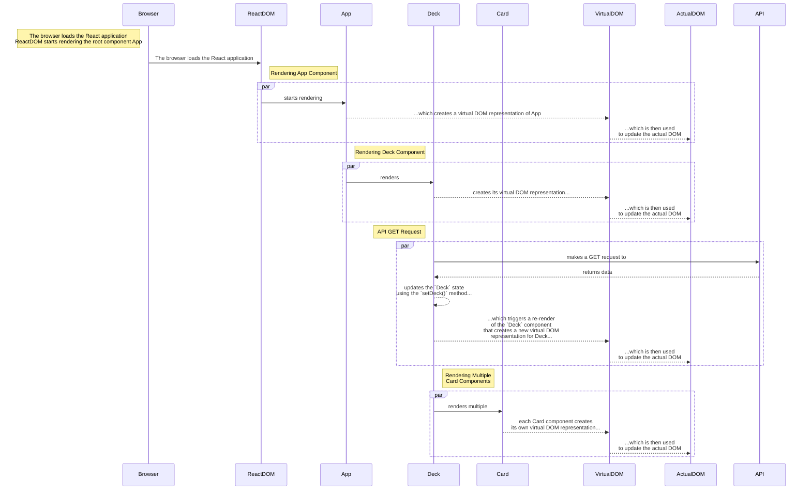
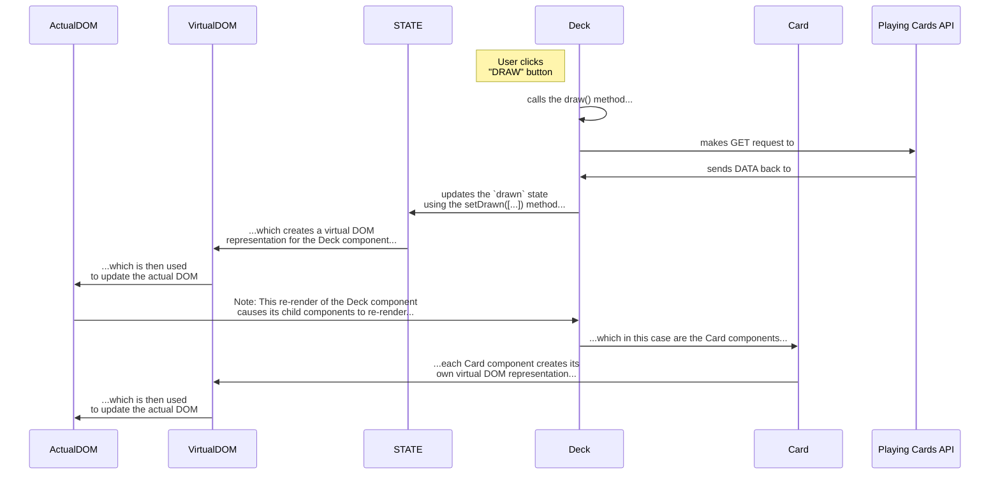
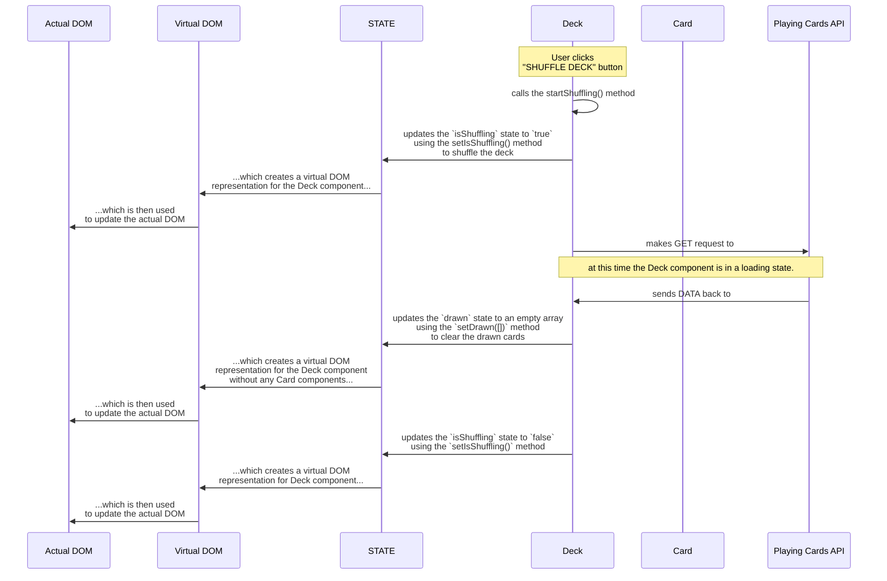
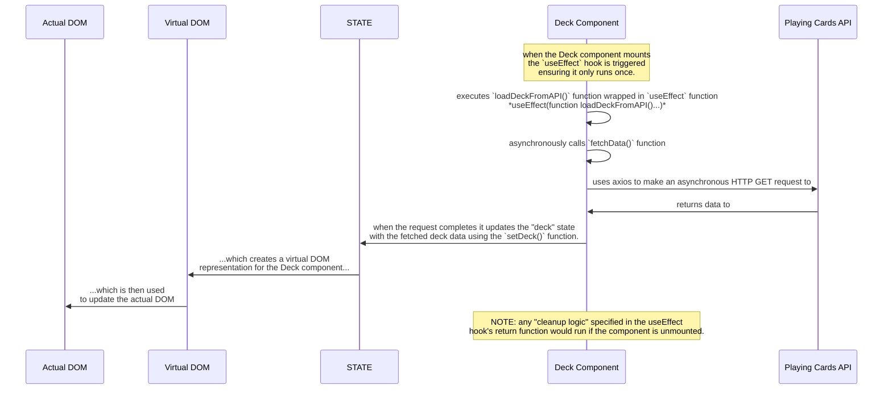
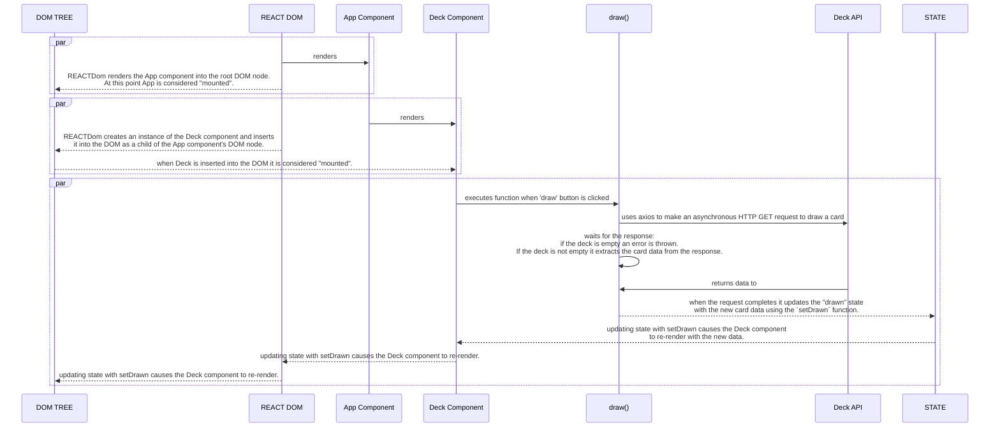
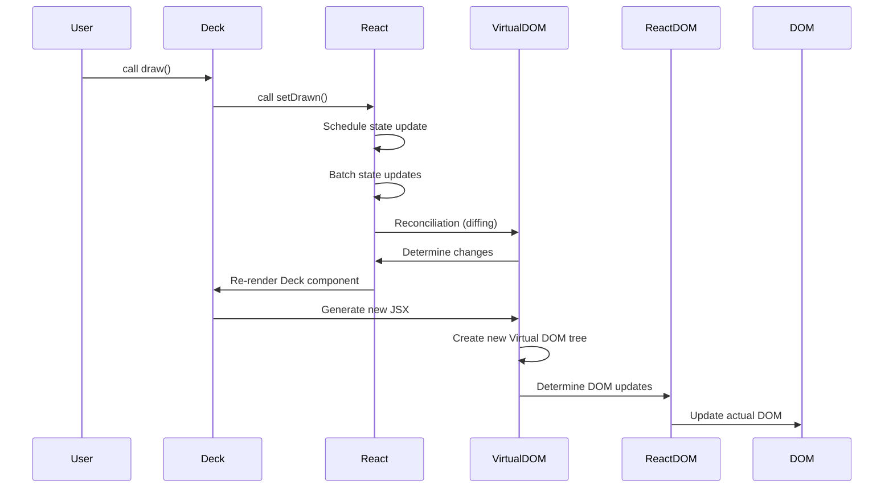
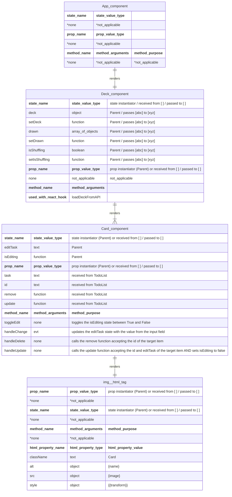

# React Effects and Refs Exercise

This repository contains the solution code for the React Card Effects project. The project focuses on implementing various card effects using React.

## Table of Contents

- [React Effects and Refs Exercise](#react-effects-and-refs-exercise)
  - [Table of Contents](#table-of-contents)
  - [Assignment Instructions](#assignment-instructions)
    - [**Part 1: Click to Draw**](#part-1-click-to-draw)
    - [**Part 2: Shuffle The Deck**](#part-2-shuffle-the-deck)
    - [**Further Study**](#further-study)
  - [How the application is rendered by React - **on initial render/first load**](#how-the-application-is-rendered-by-react---on-initial-renderfirst-load)
  - [How the application is rendered by React **after User Input**](#how-the-application-is-rendered-by-react-after-user-input)
    - [User clicks "DRAW" button](#user-clicks-draw-button)
    - [User clicks "SHUFFLE DECK" button](#user-clicks-shuffle-deck-button)
  - [Component Structure \& Overview](#component-structure--overview)
    - [`Deck.js`](#deckjs)
      - [1. Summary](#1-summary)
      - [2. Props](#2-props)
      - [3. State](#3-state)
      - [4. Methods](#4-methods)
        - [(i) loadDeckFromAPI()](#i-loaddeckfromapi)
        - [(ii) `draw()`](#ii-draw)
        - [(iii) `startShuffling()`](#iii-startshuffling)
        - [(iv) `renderDrawBtnIfOk()`](#iv-renderdrawbtnifok)
    - [Title: React State Update and Re-rendering Process](#title-react-state-update-and-re-rendering-process)
  - [Component Hierarchy](#component-hierarchy)
  - [Installation](#installation)
  - [Usage](#usage)
  - [Contributing](#contributing)
  - [License](#license)

## Assignment Instructions

### **Part 1: Click to Draw**

Build an app that displays a deck of cards, one card at a time. When the page loads, go to the [Deck of Cards API](http://deckofcardsapi.com/) to create a new deck, and show a button on the page that will let you draw a card.

Every time you click the button, display a new card, until there are no cards left in the deck. If you try to draw when there are no cards remaining, an alert message should appear on the screen with the text “Error: no cards remaining!”.

**Our solution has some fancy CSS styling. The goal here is to focus on React and not CSS so please get the core functionality working and then get a code review. Do not focus on CSS at all for now.**

Here’s how this might look (with styling added):

<video width="600" controls>
  <source src="public/use%20case%20video.mp4" type="video/mp4">
  Your browser does not support the video tag.
</video>

### **Part 2: Shuffle The Deck**

Add a button that when clicked, will shuffle the deck, so that you can start drawing from a full deck without refreshing the page. You’ll have to make a call to the cards api to shuffle the existing deck. The button should not be clickable while the shuffle is in progress. The shuffle should remove all of the cards from the screen.

### **Further Study**

- Style your app so that it looks nice.
- Change the behavior of the app so that when you click on the button rather than drawing a single card, the page will draw one card every second. These draws will continue until you press the button again, or until the deck has been exhausted (at which point the alert message from Part 1 should appear). Make sure to change the button text appropriately as well (for example, it could toggle between “Start drawing” and “Stop drawing.”

You will have to investigate the *useRef* hook to manage a *setInterval* call.

## How the application is rendered by React - **on initial render/first load**

The diagram below illustrates the process of rendering a React application and its components, based on the provided code. Here's a summary of the sequence:

1. Loading the React App:

- The browser loads the React application, and `ReactDOM` starts rendering the root component, `App`.

2. Rendering `App` Component:

- `ReactDOM` renders the `App` component, which creates a virtual DOM representation of the `App` component.
- The virtual DOM is then used to update the actual DOM.

3. Rendering Deck Component:

- The `App` component renders the `Deck` component.
- The `Deck` component creates its virtual DOM representation, which is then used to update the actual DOM.

4. Fetching Data from API:

- The `Deck` component fetches data from an API using `axios` and updates its state with the fetched data.
- The state update triggers a re-render of the `Deck` component, creating a new virtual DOM and updating the actual DOM.

5. Rendering Card Components:

- The `Deck` component renders multiple `Card` components.
- Each `Card` component creates its virtual DOM representation, which is then used to update the actual DOM.



## How the application is rendered by React **after User Input**

The diagrams below illustrate the sequence of events that occur when a user interacts with the "DRAW" and "SHUFFLE DECK" buttons in the `Deck` component.

### User clicks "DRAW" button

1. The `draw` function is called.
2. The state is updated using the `setDrawn` method.
3. A new virtual DOM representation for the `Deck` component is created.
4. The actual DOM is updated based on the new virtual DOM.
5. The `Deck` component renders multiple `Card` components.
6. Each `Card` component creates its own virtual DOM representation.
7. The actual DOM is updated based on the new virtual DOM for each `Card`.



### User clicks "SHUFFLE DECK" button

1. The `startShuffling` function is called.
2. The `isShuffling` state is updated to `true` using the `setIsShuffling` method.
3. A new virtual DOM representation for the `Deck` component is created.
4. The actual DOM is updated based on the new virtual DOM.
5. The `Deck` component makes a GET request to the Playing Cards API using `axios` to shuffle the deck.
6. The API sends the shuffled deck data back to the `Deck` component.
7. The `drawn` state is updated using the `setDrawn([])` method to clear the drawn cards.
8. The `isShuffling` state is updated to `false` using the `setIsShuffling` method.
9. A new virtual DOM representation for the `Deck` component is created.
10. The actual DOM is updated based on the new virtual DOM.

This sequence ensures that the deck is shuffled, the drawn cards are cleared, and the UI is updated accordingly. The `Card` components are re-rendered as part of the `Deck` component's re-rendering process.



## Component Structure & Overview

### `Deck.js`

#### 1. Summary

The `Deck` component is responsible for managing a deck of cards using the Deck of Cards API. It allows users to draw cards one at a time and shuffle the deck. The component maintains its state using React hooks and renders the drawn cards using the `Card` component.

#### 2. Props

The `Deck` component does not receive or pass any props from/to its parent/children.

#### 3. State

The `Deck` component uses three pieces of state:

- `deck`: Stores the deck information fetched from the API.
- `drawn`: An array that keeps track of the cards that have been drawn.
- `isShuffling`: A boolean that indicates whether the deck is currently being shuffled.

#### 4. Methods

##### (i) loadDeckFromAPI()

the `loadDeckFromAPI` function in the `Deck` component is responsible for fetching a new shuffled deck of cards from an external API when the component is first mounted. Here's a detailed explanation of how it works in the context of the `Deck` component:

- `useEffect` - is used to perform side effects in functional components. In this case, it is used to fetch the deck of cards when the component mounts. The `useEffect` hook takes two arguments:
  - a function that contains the side effect logic.
  - an optional dependency array. If this array is empty (`[]`), the effect runs only once after the initial render (e.g., when the component mounts).
- `loadDeckFromAPI` function - is defined inside the `useEffect` hook. It is an asynchronous function that fetches data from the API and updates the `deck` state.
- `fetchData` - is an asynchronous function defined within `loadDeckFromAPI` which performs the following steps:
  - API Call: it uses `axios` to make a GET request to the API endpoint `${API_BASE_URL}/new/shuffle/` and this endpoint returns a new shuffled deck of cards.
  - State Update: once the data is fetched it updates the `deck` state using the `setDeck` function which is a state-updater function returned by the `useState` hook.
  - `axios`- is a promise-based HTTP client for making requests to external APIs. In this case it is used to fetch the deck of cards from the API. The `axios.get` method returns a promise that resolves to the response object containing the data from the API.
- Synchronous/Asynchronous Operations:
  - Asynchronous: The `fetchData` function is asynchronous, meaning it performs the API call without blocking the execution of the rest of the code. The `await` keyword is used to wait for the promise returned by `axios.get` to resolve.
  - Synchronous: The state update using `setDeck` is synchronous in the sense that it schedules a state update, **but the actual state change and re-rendering of the component happen asynchronously**.
- Mounting and Unmounting
  - Mounting: The `useEffect` hook with an empty dependency array runs only once when the component mounts. This ensures that the `fetchData` function is called to fetch the deck of cards only when the component is first rendered.
  - Unmounting: In this case, there is no cleanup function provided in the `useEffect` hook, so nothing special happens when the component unmounts.



##### (ii) `draw()`

This asynchronous function draws a card from the deck and updating the component's state to reflect the drawn card. It makes an API request to draw a card using the deck ID. If the deck is empty, it throws an error. Otherwise, it updates the `drawn` state with the new card's information.

Asynchronous Operation

- The `draw` function is declared as `async`, which means it will handle asynchronous operations using `await`.
- It makes an asynchronous HTTP GET request to the Deck of Cards API using `axios.get`. The URL includes the `deck_id` to draw a card from the specific deck.

Handling the Response

- The response from the API (`drawRes`) contains data about the drawn card.
- It checks if there are no remaining cards (`drawRes.data.remaining === 0`). If true, it throws an error indicating the deck is empty.
- It extracts the first card from the response (`drawRes.data.cards[0]`).

Updating State

- The `setDrawn` function is used to update the `drawn` state, which is an array of drawn cards.
- It uses the functional form of `setDrawn` to ensure it works with the current state (`d`).
- It spreads the existing `drawn` array and adds the new card object to it.
- If an error occurs (e.g., the deck is empty), it catches the error and displays an alert.



##### (iii) `startShuffling()`

the `startShuffling` function in the `Deck` component is responsible for shuffling the deck of cards and resetting the drawn cards.

**State Management:**

- `setIsShuffling(true)`: This sets the `isShuffling` state to `true`, indicating that the shuffling process has started. This state is used to disable the shuffle button while the shuffling is in progress.
  - `setDrawn([])`: This resets the `drawn` state to an empty array, effectively clearing all drawn cards.

**Asynchronous Operation:**

- `await axios.get('${API_BASE_URL}/${deck.deck_id}/shuffle/');`: makes an asynchronous HTTP GET request to shuffle the deck using the `axios` library. The `await` keyword ensures that the function waits for the request to complete before proceeding.

**Error Handling:** - The `try...catch` block is used to handle any errors that may occur during the shuffling process. If an error occurs, an alert is shown with the error message.

**Final State Update:**

- `finally { setIsShuffling(false); }`: This ensures that the `isShuffling` state is set back to `false` once the shuffling process is complete, regardless of whether it succeeded or failed. This re-enables the shuffle button.

**Synchronous/Asynchronous Operations**

- Synchronous: The state updates (`setIsShuffling`, `setDrawn`) are synchronous operations. They schedule updates to the component's state, which will trigger a re-render.
- Asynchronous: The `axios.get` call is asynchronous and uses the `await` keyword to pause the function execution until the HTTP request completes.

**Mounting and Unmounting**

- The `startShuffling` function does not directly affect the mounting or unmounting of the component. However, it does trigger state changes that can lead to re-renders.

**State Management and Props**

- State Management: The function manages the component's state by updating `isShuffling` and `drawn`. These state changes are crucial for controlling the UI (e.g., disabling buttons) and resetting the drawn cards.
- Props: The function does not directly interact with props but relies on the `deck` state, which is initially set by the `loadDeckFromAPI` effect.

**Re-rendering**

- Does it cause a re-render?: Yes, the `startShuffling` function causes the component to re-render. When `setIsShuffling(true)` and `setIsShuffling(false)` are called, they update the state, which triggers a re-render. Similarly, `setDrawn([])` updates the `drawn` state, leading to another re-render.

##### (iv) `renderDrawBtnIfOk()`

the `renderDrawBtnIfOk` function in the `Deck` component is responsible for conditionally rendering the "DRAW" button based on the state of the deck and whether the deck is currently being shuffled.

- **State Check:** The function first checks if the `deck` state is `null`. If it is, the function returns `null`, meaning no button will be rendered. **_This ensures that the "DRAW" button is only displayed when a deck has been successfully loaded._**

**Button Rendering:** If the `deck` state is not `null`, the function returns a `<button>` element with the following properties:

- **Class Name:** The button is styled using the Deck-gimme CSS class.
- **onClick Handler:** The onClick event is set to call the draw function, which handles drawing a card from the deck.
- **Disabled State:** The button is disabled if isShuffling is true, preventing the user from drawing a card while the deck is being shuffled.

**Interaction with Other Methods and Components**

- **State Management:** The `renderDrawBtnIfOk` function relies on the `deck` and `isShuffling` state variables to determine (i) whether to render the button and (ii) whether it should be enabled or disabled.
  - **`deck`:** Managed by the `setDeck` function, which is called in the `useEffect` hook to load a new deck from the API.
    - **`isShuffling`:** Managed by the `setIsShuffling` function, which is called in the `startShuffling` function to indicate whether the deck is currently being shuffled.

**Asynchronous Operations:** The `draw` function, which is called when the button is clicked, performs an asynchronous operation using `axios.get` to draw a card from the deck. The state is updated based on the result of this operation.

**`Mounting and Unmounting:`** The `renderDrawBtnIfOk` function is called during the rendering phase of the `Deck` component. It does not directly handle mounting or unmounting but is part of the component's render logic. - **`Props:`** The `renderDrawBtnIfOk` function does not directly interact with props but relies on the state managed within the `Deck` component.

---

### Title: React State Update and Re-rendering Process

This sequence diagram illustrates the internal processes that occur in a React application when the `draw` function is called to draw a card. It shows how the state is updated using the `setDrawn` function, leading to a series of steps including state update scheduling, batching, virtual DOM diffing, and ultimately updating the actual DOM to reflect the new state. This ensures efficient and optimized rendering of the UI.



---

## Component Hierarchy



## Installation

To get started with the React Card Effects Solution, follow these steps:

1. Clone the repository: `git clone https://github.com/your-username/react-card-effects-solution.git`
2. Navigate to the project directory: `cd react-card-effects-solution`
3. Install the dependencies: `npm install`

## Usage

To run the React Card Effects Solution, use the following command:

```
npm start
```

This will start the development server and open the application in your default browser.

## Contributing

Contributions are welcome! If you have any ideas, suggestions, or bug reports, please open an issue or submit a pull request.

## License

This project is licensed under the [MIT License](LICENSE).
